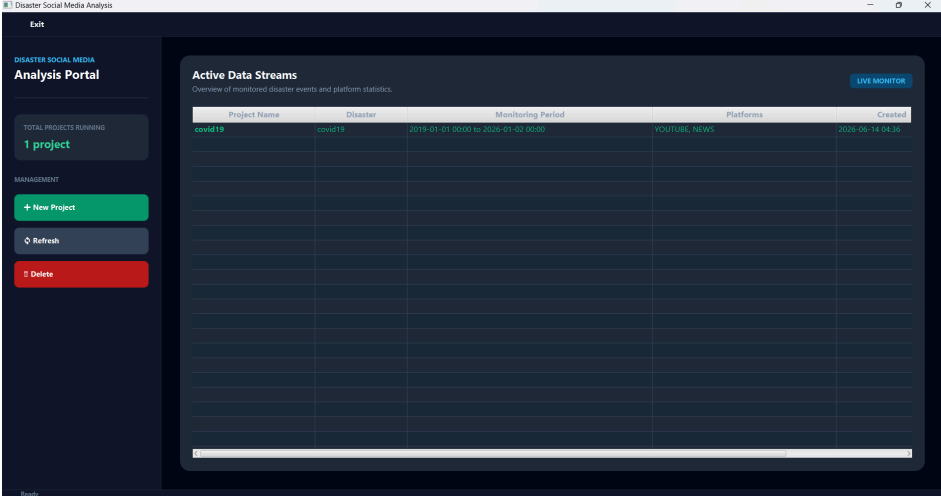
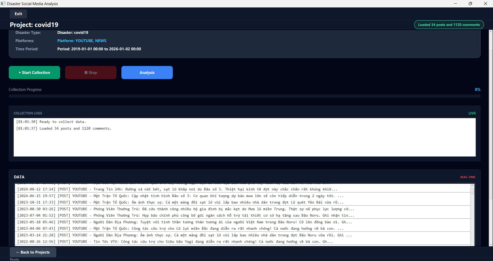
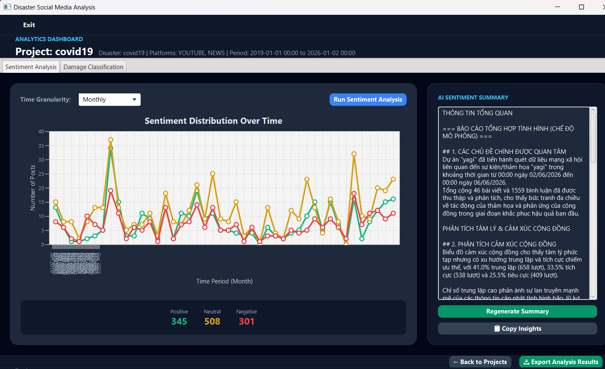
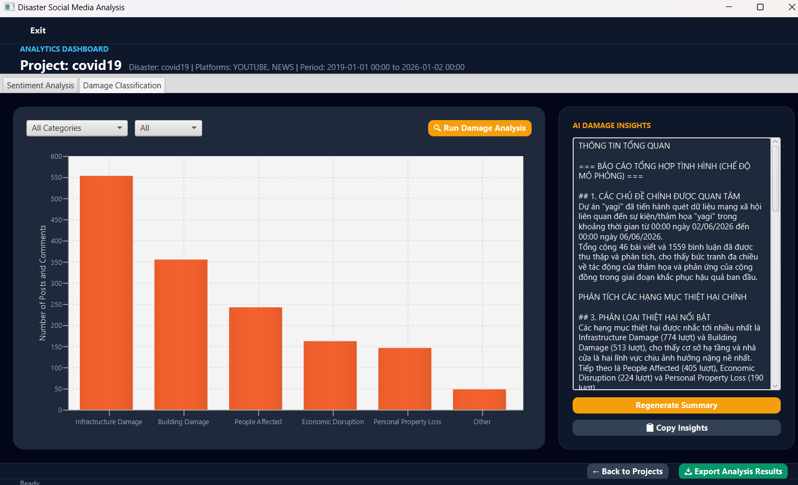

# 災害SNSデータ分析ポータル (Disaster Social Media Analysis Portal)

災害時におけるSNSやニュースサイトのデータを収集・分析し、状況把握や意思決定を支援する分析ポータルシステムです。

---

## 🚀 主要機能 (Features)

### 1. マルチプラットフォームからの自動データ収集・前処理
* **自動収集:** キーワード（台風名など）や対象期間を指定し、YouTubeやニュースサイト（VnExpress、Dantri、Thanhnien等）から投稿およびコメントデータを自動的に収集します。
* **データ前処理:** 収集したテキストデータのクレンジングおよび標準化を自動で行います。

---

### 2. 時系列による感情・心理分析 (Sentiment Analysis)
* **感情追跡:** 時間軸（時間単位、日単位、週単位、月単位）ごとに、ポジティブ・ネガティブ・ニュートラルの感情推移をグラフ化します。
* **心理変化の把握:** 災害発生時の不安から復旧フェーズへの変化など、被災者の心理推移を追跡できます。

---

### 3. 被害状況・種類の自動分類 (Damage Classification)
* **自動カテゴリ分類:** 収集した投稿やコメントを以下の主要被害カテゴリに自動分類します。
  * 被災者 (People Affected)
  * 家屋・建物の損壊 (Building Damage)
  * インフラの損壊 (Infrastructure Damage)
  * 個人財産の喪失 (Personal Property Loss)
  * 経済・生産活動の断絶 (Economic Disruption)
  * その他 (Other)
* **被害状況の可視化:** 最も報告数が多い被害の種類や深刻度を正確に把握できます。

---

### 4. AIを活用した高度な定性分析 (AI Insights)
* **自動要約・提案:** 統合されたAIモデル（Gemini / OpenAI）を活用し、プロジェクト全体の分析要約や具体的な対策案・ソリューションの提案を自動生成します。

---

### 5. データの可視化とエクスポート (Export)
* **直感的なGUI:** JavaFXを用いたグラフ表示により、各種統計データをインタラクティブに確認できます。
* **Excel出力:** 分析結果や収集データをExcelファイル（.xlsx）として簡単に保存・出力できます。
